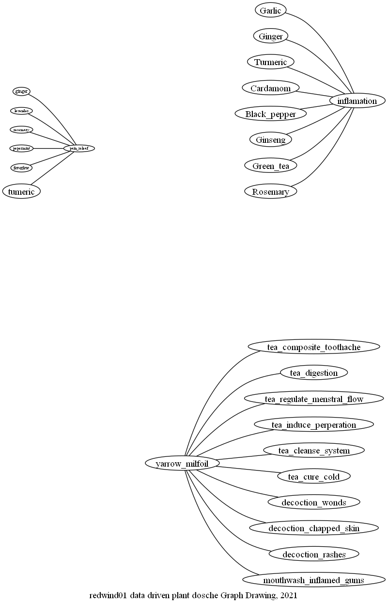

plant_mindmap.png

mushrooms%2Fmushrooms_edible%2FTypes-of-Mushrooms-7-122221.jpg

D:\documents\GitHub\Free time coding\_MINDMAP\___show_me.md
D:\documents\GitHub\Free time coding\_MINDMAP\mushrooms\mushrooms_edible\Types-of-Mushroom-1-122221.jpg

 

 
 
 
 
 
 
 
 
 
 
 
 
 
 
 
 
 
 
 
 
 
 
 
 
 
 
 
 
 
 
 
 
 
 
 
 
 
 
 
 
 
 
 
 
 
 
 
 
 
 
 
 
 
 
 
 
